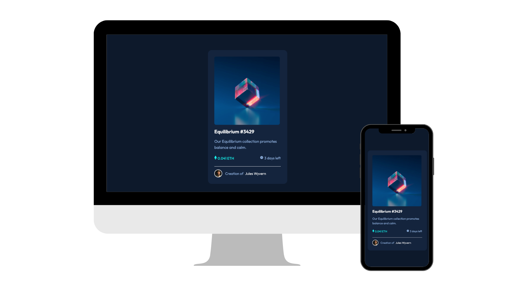

# Frontend Mentor - NTF Preview Card Component

A responsive card for the NTF Equilibrium, built using HTML and CSS. The card have a section that introduces the NTF to the clieny. This project was completed as part of the Frontend Mentor challenges.

## Features

- Responsive design that ensures optimal user experience across devices.
- Introduction card providing key details about the NTF.
- Clear and engaging layout to attract users' attention.

## Technologies Used 🛠️

-  HTML5: Markup language for structuring the web page.
-  CSS3: Styling language for design and presentation.

## Usage Instructions

1. Clone this repository 
2. Navigate to the project directory
3. Open the `index.html` file in your web browser to view the Huddle platform landing page.
4. Explore the introduction section and observe the responsiveness on different devices.

## Contributions

Contributions are welcome! If you have ideas for improvements or want to contribute in any way, please submit a pull request.

## Author ✒️

- **Codigo40** - [Codigo40](https://github.com/codigo40)
